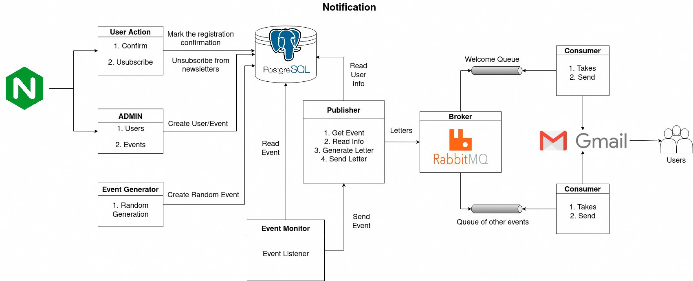

## Спринт №10
### Сервис Нотификации

### UPD: Для ревью спринта 10 
- Ссылки: 
  - [Репозиторий проекта notification_sprint_1](https://github.com/svvladimir-ru/notifications_sprint_1)
  - [DeepBlue](https://github.com/BigDeepBlue)  



### Структура проекта

1. Nginx - прокси сервер, для сервисов Admin и User Action
2. Admin - административная панель управления пользователями и событиями онлайн кинотеатра
3. User Actions - api для подтверждения регистрации пользователя и отписки от рассылок
4. Event Generator - генератор событий, которые будут рассылаться пользователям
5. PostgreSQL - база данных для хранения информации о пользователях и событиях
6. Event Monitor - ETL для мониторинга появляющихся событий и передачи их в Publisher
7. Publisher - API, принимающее событие от ETL, формирующее письма и отправки их в нужную очередь RabbitMQ
8. RabbitMQ - база для формирования очередей рассылок
9. Consumer - сервис для сбора подготовленных писем из очереди и отправки их на сервис рассылок
10. Gmail - сервис для рассылки писем

## Установка

Установите Docker и Docker-Compose.

[См. официальная документация по установке Docker](https://docs.docker.com/engine/install/) <br>
[См. официальная документация по установке Docker compose](https://docs.docker.com/compose/install/)

Скопируйте содержимое образца файла окружения `cp env.sample .env` в следующих директорях:
1. `services/nginx`
2. `services/postgres`
3. `services/`
4. `actions_api/`
5. `admin/`
6. `event_generator/`
7. `events_etl`

Собрать все контейнеры
```
docker-compose --profile init --profile main  build
```

### Запуск проекта

Для проекта организовано два профиля:
1. init - используется для первого запуска. `docker-compose --profile init up`
2. main - дальнейшие запуски. `docker-compose --profile main up`

### После первого запуска

Необходимо создать через панель администрирования два шаблона (`Templates`):
1. `event` - с содержанием из файла `email_templates/event.html`
2. `welcome` - с содержанием из файла `email_templates/welcome.html`

Далее добавить пользователей (`User`) для рассылок.

